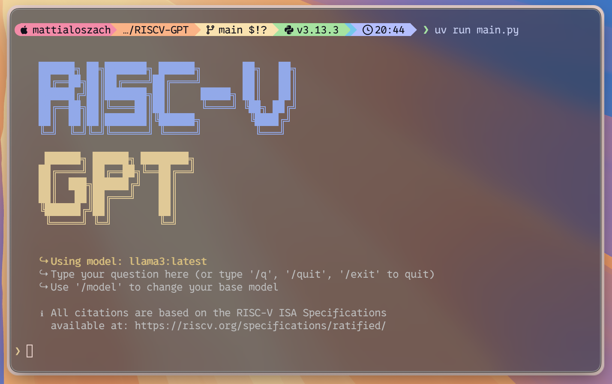
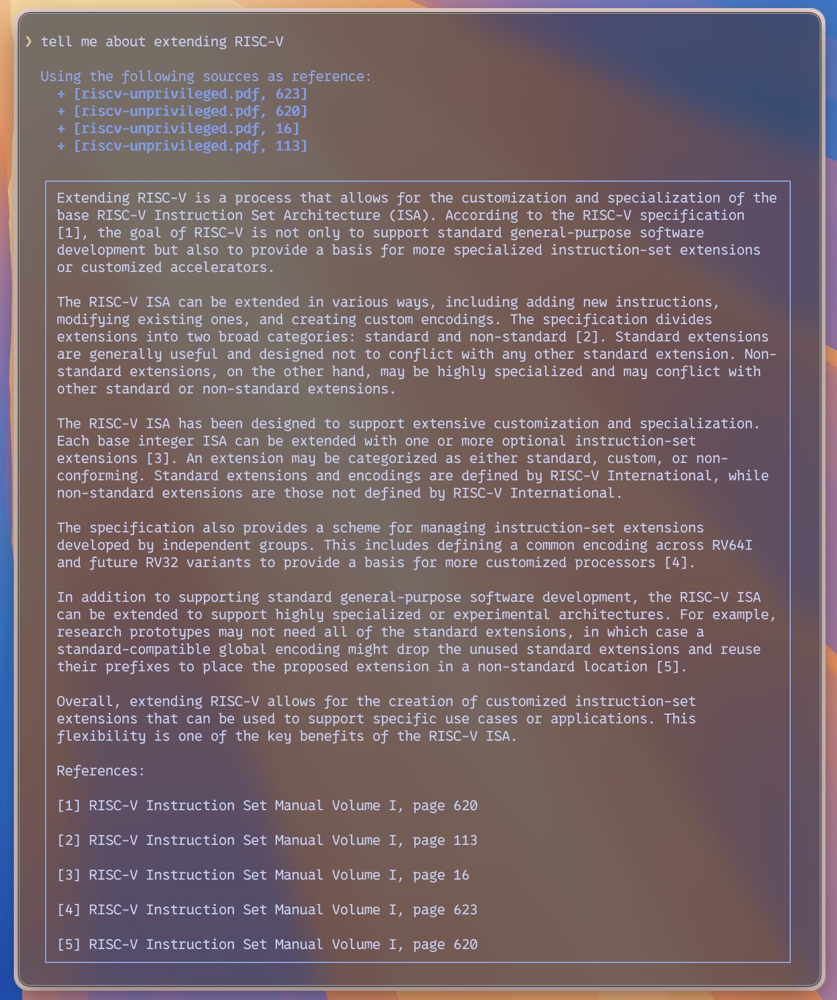
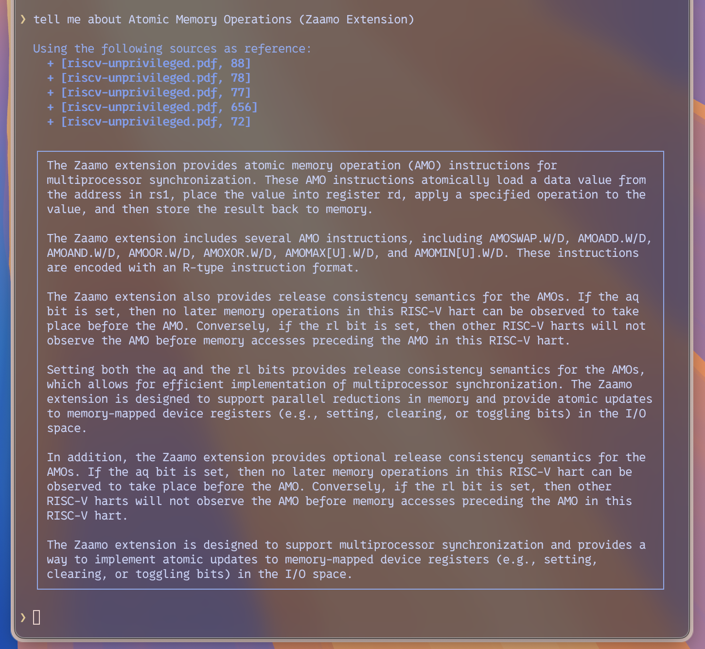
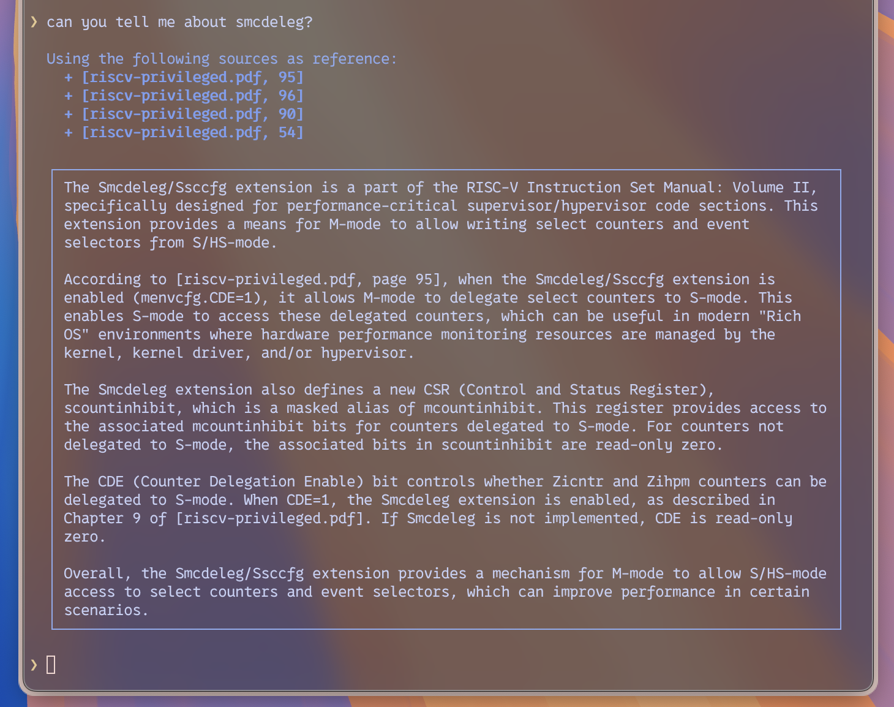
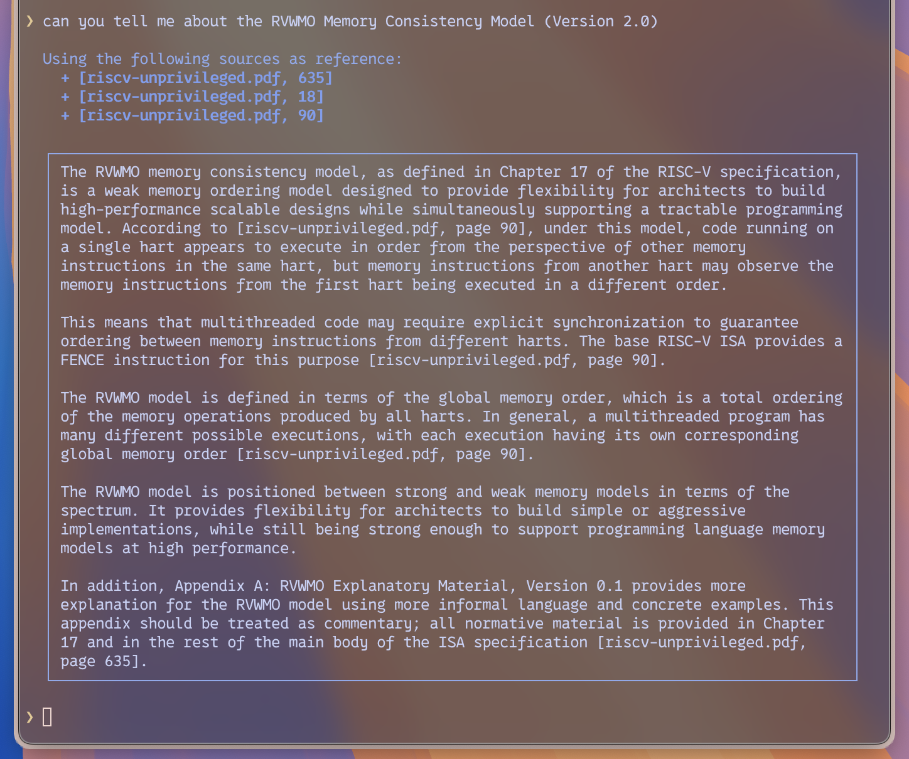
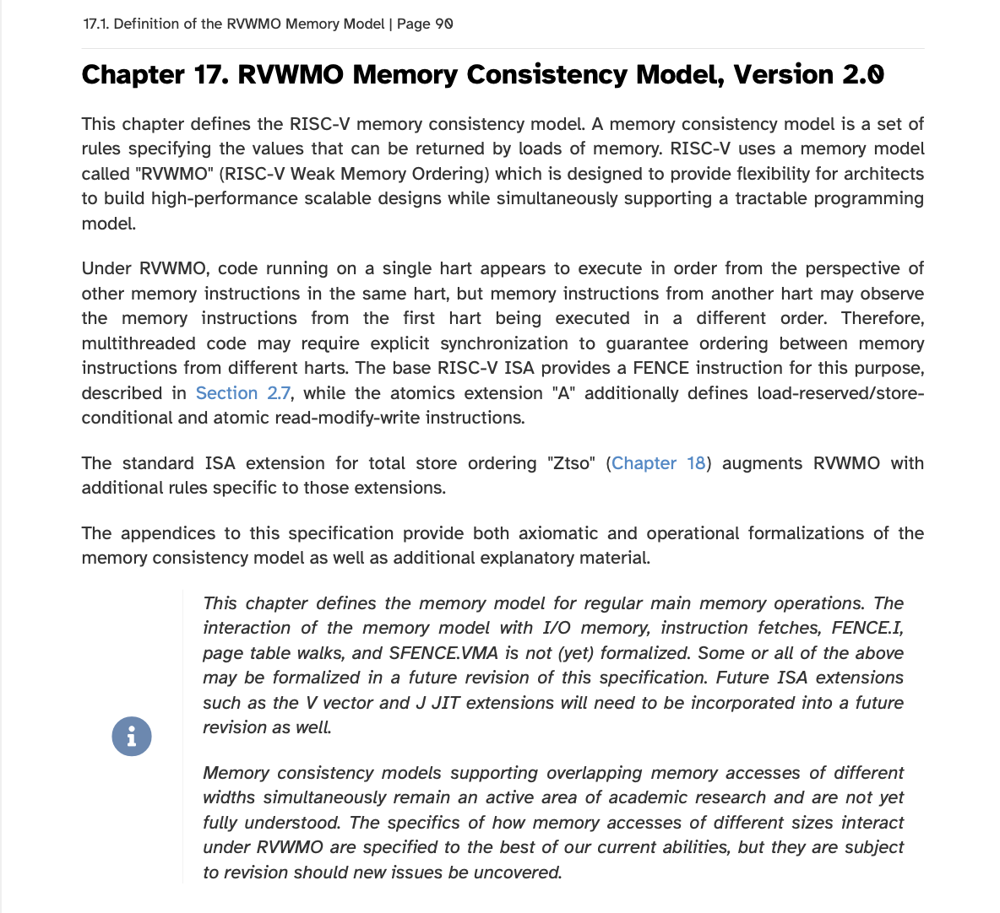

# 🖥️ RISCV-GPT
## RAG-powered answers for the official RISC-V ISA


I built RISCV-GPT while studying for my Computer Engineering exam on the RISC-V architecture. Whenever I asked very specific ISA questions, general-purpose LLMs often replied with vague, incomplete, or even wrong answers. Because RISC-V has [official technical specifications](https://riscv.org/specifications/ratified), I created a Retrieval-Augmented Generation (RAG) tool that preprocesses the [official PDFs](https://lf-riscv.atlassian.net/wiki/spaces/HOME/pages/16154769/RISC-V+Technical+Specifications), stores them in a vector database, and lets you query them with the LLM of your choice via Ollama. All of this, with precise, checkable citations to the manuals.



## 🚀 Quick Overview
- Preprocessing the official PDFs (e.g., [Unprivileged ISA and Privileged Architecture manuals](https://lf-riscv.atlassian.net/wiki/spaces/HOME/pages/16154769/RISC-V+Technical+Specifications)): chunking, cleaning, and embedding the text.
- Builds a local vector database from those chunks so queries retrieve only the most relevant passages.
- Assembles an extended context for the LLM from the retrieved passages.
- Attaches metadata (source PDF and page numbers) gathered during preprocessing so the model can **quote/cite** exactly where facts come from.
- Runs locally with Ollama so you can pick any supported model (developed and tested primarily with Llama 3, which worked perfect).
- Interactive CLI: ask in-depth questions, switch models on the fly (/model), and exit quickly (/q, /quit, /exit).
- Transparent sourcing: the app prints which spec pages were used and encourages fact-checking in the original manuals.

## Some Examples:




Actual source (for comparison):


## 🛠️ Setup & Run (using uv and Ollama)
This repo uses [uv](https://github.com/astral-sh/uv) for Python environments & dependency management.

### Prerequisites
- [Ollama](https://ollama.com)
- [uv](https://github.com/astral-sh/uv)

### Clone this repository
```bash
https://github.com/mattialoszach/RISCV-GPT.git
cd RISCV-GPT
```

### Sync the environment with uv
This reads pyproject.toml and installs dependencies.
```bash
uv sync
```

### Start the Chat UI
```bash
uv run main.py
```

## 💡 How to use it effectively
- Ask specific, technical questions (e.g., “What does cbo.clean do?”, “Explain the RVWMO atomicity axiom,” “What is the D extension about?”).
- Skim the source list printed before the answer to see which spec pages were used.
- The answer includes inline citations (per the system prompt’s rules). You can check the exact page in the official manual.
- Use /model to try different models via Ollama; RISCV-GPT adapts without restarting.

> [!NOTE]
> ### 📚 Data sources
> All citations come from the official RISC-V ISA specifications: [https://riscv.org/specifications/ratified/](https://riscv.org/specifications/ratified/)

> [!NOTE]
> ### 📌 Notes on models, prompting & citations
> - RISCV-GPT was developed with Llama 3, which performed excellently. Other Ollama models work too, but behavior can vary by model family and size.
> - For a consistent quoting/citation format, either:
>   - Adjust the system prompt (recommended), or
>   - Provide a short instruction to the LLM at runtime describing the citation style you want.
> - You can tweak temperature (defaults around ~0.4 in my setup) to balance precision and verbosity.

## 🔮 Roadmap & ideas for contributions
- System prompt optimization: style, structure, and stricter citation enforcement.
- Model experiments: temperature, top-p, different Llama/QLoRA/Mistral/Mixtral variants.
- Vector DB improvements: better chunking strategies, hybrid search (BM25 + vectors), re-ranking.
- Document set expansion: include more ratified extensions, memory model text, debug/trace specs, toolchain docs.
- Evaluator & tests: question suites with expected citations to validate accuracy over time.

## 📜 Acknowledgments & Disclaimer
- Specs © their respective owners; this project simply indexes and cites them for research/learning.
- Not affiliated with RISC-V International.
- Always verify critical details in the official manuals.
